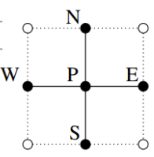

# 计算流体力学概述

## 1 有限差分法

**有限差分法**：基于待求解偏微分方程的微分形式，通过有限差分来近似导数，从而寻求微分方程的近似解.

差分格式构建方法：**泰勒展开法**、**多项式逼近法**.

### 1.1 泰勒展开

使用泰勒展开法，对于物理量 $\phi(x)$，有：

$$
\phi(x)=\phi(x_i)+\sum\limits_{i=1}^n\dfrac{(x-x_i)^n}{i!}\left(\dfrac{\partial^i\phi}{\partial x^i}\right)_i+H
$$

在 $x_{i+1}$ 处，有：

$$
\left(\dfrac{\partial\phi}{\partial x}\right)_i=\\\dfrac{\phi_{i+1}-\phi_i}{x_{i+1}-x_i}-\dfrac{x_{i+1}-x_i}2\left(\dfrac{\partial^2\phi}{\partial x^2}\right)_i-\dfrac{(x_{i+1}-x_i)^2}6\left(\dfrac{\partial^3\phi}{\partial x^3}\right)_i+H\tag{1}
$$

**前向差分**：

$$
\left(\dfrac{\partial\phi}{\partial x}\right)_i\approx\dfrac{\phi_{i+1}-\phi_i}{x_{i+1}-x_i}
$$

在 $x_{i-1}$ 处，有：

$$
\left(\dfrac{\partial\phi}{\partial x}\right)_i=\\\dfrac{\phi_{i}-\phi_{i-1}}{x_{i}-x_{i-1}}+\dfrac{x_{i}-x_{i-1}}2\left(\dfrac{\partial^2\phi}{\partial x^2}\right)_i-\dfrac{(x_{i}-x_{i-1})^2}6\left(\dfrac{\partial^3\phi}{\partial x^3}\right)_i+H\tag{2}
$$

**后向差分**：

$$
\left(\dfrac{\partial\phi}{\partial x}\right)_i\approx\dfrac{\phi_{i}-\phi_{i-1}}{x_{i}-x_{i-1}}
$$

结合 $(1),(2)$ 可得**中心差分**：

$$
\left(\dfrac{\partial\phi}{\partial x}\right)_i=\\
\dfrac{\phi_{i+1}-\phi_{i-1}}{x_{i+1}-x_{i-1}}-\dfrac{(x_{i+1}-x_i)^2-(x_i-x_{i-1})^2}{2(x_{i+1}-x_{i-1})}\left(\dfrac{\partial^2\phi}{\partial x^2}\right)_i\\-\dfrac{(x_{i+1}-x_i)^3-(x_{i}-x_{i-1})^3}{6(x_{i+1}-x_{i-1})}\left(\dfrac{\partial^3\phi}{\partial x^3}\right)_i+H\\\approx\\
\dfrac{\phi_{i+1}-\phi_{i-1}}{x_{i+1}-x_{i-1}}
$$

### 1.2 多项式逼近

使用多项式逼近法，有以下步骤：

1. 确定差分网格节点；
2. 选择多项式函数分布；
3. 计算多项式函数；
4. 对多项式求导.

假如我们使用抛物线拟合，需要三个点 $x_{i+1},x_i,x_{i-1}$. 用拉格朗日插值法求系数：

即 $P(x) = \sum_{j=0}^{2} \phi_j L_j(x)$，其中：

$$
L_0(x) = \dfrac{(x-x_i)(x-x_{i-1})}{(x_{i+1}-x_i)(x_{i+1}-x_{i-1})} \\
L_1(x) = \dfrac{(x-x_{i+1})(x-x_{i-1})}{(x_i-x_{i+1})(x_i-x_{i-1})} \\
L_2(x) = \dfrac{(x-x_{i+1})(x-x_i)}{(x_{i-1}-x_{i+1})(x_{i-1}-x_i)}\\
P(x_i) = \phi_i
$$

为了求得 $\left(\dfrac{\partial \phi}{\partial x}\right)_i$，可得到：

$$
\left(\dfrac{\partial \phi}{\partial x}\right)_i = \sum_{j=0}^{2} \phi_j \dfrac{d}{dx} L_j(x) \bigg|_{x=x_i}
$$

计算导数：

$$
\dfrac{d}{dx} L_0(x) = \dfrac{2x-x_i-x_{i-1}}{(x_{i+1}-x_i)(x_{i+1}-x_{i-1})} \\
\dfrac{d}{dx} L_1(x) = -\dfrac{2x-x_{i+1}-x_{i-1}}{(x_i-x_{i+1})(x_i-x_{i-1})} \\
\dfrac{d}{dx} L_2(x) = \dfrac{2x-x_{i+1}-x_i}{(x_{i-1}-x_{i+1})(x_{i-1}-x_i)} \\
$$

当 $x=x_i$ 时，代入可得：

$$
\left(\dfrac{\partial\phi}{\partial x}\right)_i=\\
\dfrac{\phi_{i+1}(\Delta x_i)^2-\phi_{i-1}(\Delta x_{i+1})^2+\phi_i[(\Delta x_{i+1})^2-(\Delta x_i)^2]}{\Delta x_{i+1}\Delta x_i(\Delta x_i+\Delta x_{i+1})}\tag{3}
$$

对于二阶导数：

$$
\left(\dfrac{\partial^2\phi}{\partial x^2}\right)_i\approx\dfrac{\left(\dfrac{\partial\phi}{\partial x}\right)_{i+1}-\left(\dfrac{\partial\phi}{\partial x}\right)_i}{x_{i+1}-x_i}\tag{4}
$$

$$
\left(\dfrac{\partial^2\phi}{\partial x^2}\right)_i\approx\dfrac{\left(\dfrac{\partial\phi}{\partial x}\right)_{i}-\left(\dfrac{\partial\phi}{\partial x}\right)_{i-1}}{x_{i}-x_{i-1}}\tag{5}
$$

结合 $(3),(4),(5)$ 使用中心差分：

$$
\left(\dfrac{\partial^2\phi}{\partial x^2}\right)_i\\
\approx\dfrac{\phi_{i+1}(x_i-x_{i-1})+\phi_{i-1}(x_{i+1}-x_i)-\phi_i(x_{i+1}-x_{i-1})}{\frac12(x_{i+1}-x_{i-1})(x_{i+1}-x_i)(x_i-x_{i-1})}
$$

## 2 一维定常对流扩散方程

一维定常对流扩散方程：

$$
\dfrac{\partial \rho u\phi}{\partial x}=\dfrac{\partial}{\partial x}\left(\Gamma\dfrac{\partial \phi}{\partial x}\right)
$$

$\Gamma$：扩散系数. $\dfrac{\partial\rho u}{\partial x}$：对流速度.

平面网格上的五个位置 $P,N,E,S,W$：

有 $A_W\phi_W+A_S\phi_S+A_P\phi_P+A_N\phi_N+A_E\phi_E=Q_P$.

考虑三个网格节点的差分： $A^i_P\phi^i+A_E^i\phi^{i+1}+A_W^i\phi^{i-1}=Q^i$. 

对扩散项做中心差分，有：

$$
\left(\Gamma\dfrac{\partial\phi}{\partial x}\right)_{i+\frac12}\approx\Gamma\dfrac{\phi_{i+1}-\phi_i}{x_{i+1}-x_i}\\
\left(\Gamma\dfrac{\partial\phi}{\partial x}\right)_{i-\frac12}\approx\Gamma\dfrac{\phi_{i}-\phi_{i-1}}{x_i-x_{i-1}}
$$

